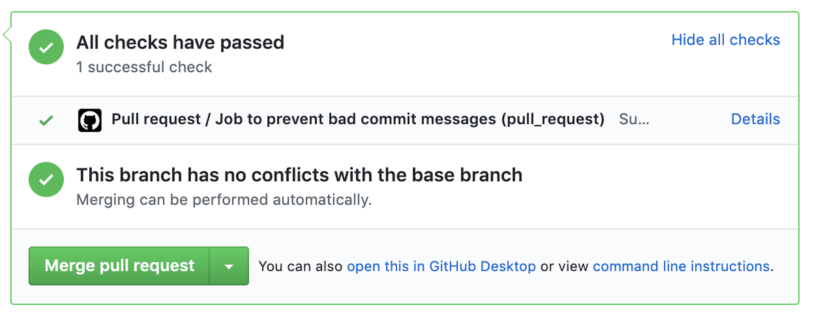

# [WIP] clean-commit-action
 Clean-commit-action is a simple action to prevent bad git commit messages.

# Why

Commit message plays a very important role and is the best way to communicate the context to the future developers as well as to ourselves when you go and see the commit after a long span of time. We ourselves sometime fail to realize why the change was made if the commit message doesn't give a proper context.

Some Examples of bad commit messages
* fix travis
* Review fix
* bug fix

Its very tough to get the context by seeing the above commit messages.

Some examples of good commit messages
* Fix travis build due to 301 redirect
* Add a safe check of string for message since backend might return boolean
* Add a prop renderTags for custom rendering of tags

There are tools like [commitzen](https://github.com/commitizen/cz-cli) which helps us to write good commit messages but in that case the proper format has to be followed which might not be always feasable specially when you are working on very big feature and at that stage its hard to breakdown the commits to follow proper format. So I was looking for a tool which can help in catching bad commit messages and at the same time author is free to write the commit message in his own way but didn't find any. Hence this is an attempt to achieve the same. 

Currently its at a very early stage and I would love to hear your feedback on improving it and making it better.

# Inputs
### `repo-token`
** Required ** 

This action uses Github token passed which to access the data of the pull request.

# Example Usage

```
name: Pull request
# This workflow is triggered on pull requests for the repository.
on: [pull_request]

jobs:
  clean_commit_job:
    name: Job to prevent bad commit messages
    runs-on: ubuntu-latest
    steps:
      - name: Clean commit step
        uses: ad1992/clean-commit-action@v0.2.0
        with:
          repo-token: ${{ secrets.GITHUB_TOKEN }}

```




You will also need to add [required status check](https://help.github.com/en/github/administering-a-repository/enabling-required-status-checks) rule for this action to prevent merging.

### Contributing
Got ideas on how to make it better ? Open an issue !!.

 
